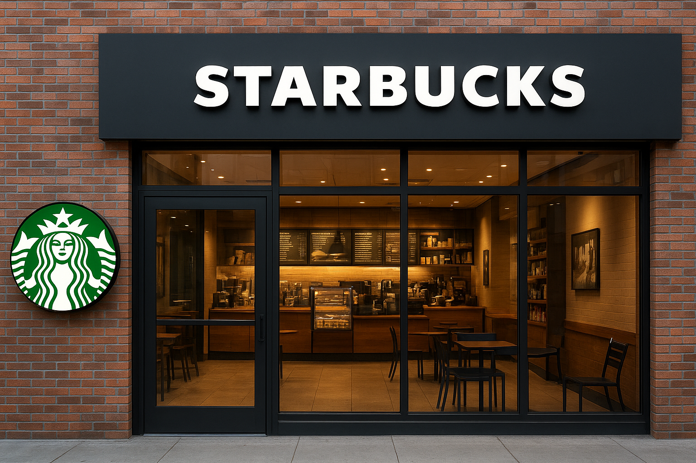

<h1 align="center"> ☕STARBUKS COFFEE SALES PERFORMANCE ANALYSIS  </h1>
<p align="center">
  <i>Data • Trends • Insights • Business Intelligence</i>  
</p>

<p align="center">
  
</p>
---

<p align="center">
  <a href="https://www.microsoft.com/en-in/microsoft-365/excel"></a>
  <a href="#"></a>
  <a href="#"></a>
 
</p>


---

## 📌 Project Overview  
This project delivers a **Starbucks-branded Excel Dashboard** to analyze sales performance.  
It highlights **revenue trends, customer patterns, product performance, and store comparisons** — providing actionable business insights for decision-makers.  

---

## 🎯 Objectives  
✔ Track **monthly, weekly & daily sales performance**  
✔ Compare **store-wise performance** across locations  
✔ Identify **top-performing and weak products**  
✔ Monitor **KPI cards** (Sales, Transactions, Growth %, Targets)  
✔ Build a **branded, presentation-ready dashboard**  

---

## 📊 Key Insights  
- 📈 **Growth Trend:** Sales increased steadily from Feb → Jun  
- 🏆 **Best Performing Store:** Hell’s Kitchen  
- 📉 **Lowest Sales Store:** Lower Manhattan  
- ⏰ **Peak Hour:** 10 AM (highest % of sales)  
- 🥇 **Top Products:** Sustainability Grown Organic (Lg), Dark Chocolate (Lg)  
- ⚠️ **Weak Products:** Brazilian (Lg), Spicy Eye Opener Chai  

---

## 🚀 Recommendations  
- Expand offerings in **high-performing product categories**  
- Re-strategize promotions for **underperforming products**  
- Focus on **morning peak hours** for campaigns & staffing  
- Leverage **store-level insights** to boost weaker outlets  
- Maintain Starbucks **green brand identity** in dashboards & reports  

---

## 🛠️ Tech Stack  
- **Microsoft Excel** → Pivot Tables, Charts, Slicers  
- **Conditional Formatting** → Product performance highlights  
- **Brand Styling** → Starbucks green theme  

---

## 📂 Project Structure  
```bash
📦 starbucks-sales-performance
 ┣ 📂 data
 ┃ ┗ transactions.xlsx        # Raw sales dataset
 ┣ 📂 dashboard
 ┃ ┗ Starbucks_Dashboard.xlsx # Interactive Excel dashboard
 ┣ 📂 images
 ┃ ┣ starbucks_store.png      # Banner image
 ┃ ┗ dashboard_preview.png    # Dashboard screenshot
 ┗ README.md
```
-----
## ⚙️** How to Run**
1️⃣ Clone this repository
git clone https://github.com/<username>/starbucks-sales-performance

2️⃣ Open dashboard/Starbucks_Dashboard.xlsx in Excel 2016+

3️⃣ Use slicers to filter by:

 1.Store Location

 2.Product Category

 3.Day of Week / Hour

4️⃣ Refresh data anytime with Ctrl + Alt + F5

------
## 📊** Dashboard Preview**

<p align="center">
  
</p>

-----
🙌** Acknowledgments**
--
1.Starbucks dataset (sample/fictionalized for project use)

2.Dashboard design inspired by Starbucks branding

-----
🚀 Future Enhancements
------
1.Add profit margin KPIs if cost data available

2.Build a Power BI version for advanced interactivity

3.Automate data refresh with Power Query

----

✅ Final Note
------
This dashboard showcases how Excel + clean branding + data storytelling can deliver powerful business insights.
A perfect blend of coffee ☕ and analytics 📊.
